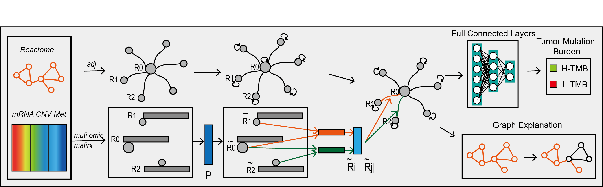

<!-- PROJECT LOGO -->
<br />
<p align="center">
  <a href="https://github.com/liuchuwei/PGLCN">
    
  </a>

<h2 align="center">PGLCN</h2>

  <p align="center">
    Biological informed graph neural network for tumor mutation burden prediction and immunotherapy-related pathway analysis in gastric cancer
    <br />
    <br />
    <br />

  </p>
</p>


<!-- TABLE OF CONTENTS -->
<details open="open">
  <summary><h2 style="display: inline-block">Table of Contents</h2></summary>
  <ol>
    <li>
      <a href="#getting-started">Getting Started</a>
      <ul>
        <li><a href="#prerequisites">Prerequisites</a></li>
        <li><a href="#installation">Installation</a></li>
      </ul>
    </li>
    <li><a href="#usage">Usage</a></li>
    <li><a href="#References">References</a></li>
    <li><a href="#license">License</a></li>
    <li><a href="#contact">Contact</a></li>
  </ol>
</details>


## Getting Started
### Prerequisites

* check environments.yml for list of needed packages

### Installation

1. Clone the repo
   ```sh
   git clone https://github.com/liuchuwei/PGLCN.git
   ```
2. Create conda environment
   ```sh
   conda env create -f environment.yml
   ```
3. Based on your use, you may need to download one or more of the following  
   a. [Data files](https://drive.google.com/drive/folders/1xPIbbOrkoGTwEcUyY9H-D92p-bIA7Oxg?usp=drive_link)  
   b. [Log files](https://drive.google.com/drive/folders/1791x5rgFCPVCwyMGLT9_MHWNCcyPokqs?usp=drive_link)  
   c. [NoteBook](https://drive.google.com/drive/folders/1X7kdC5xGwTRqdvtRXmL0uWio9S5qcrwS?usp=sharing)
<!-- USAGE EXAMPLES -->
## Usage
1. Activate the created conda environment
   ```sh
   source activate PGLCN
   ```
2. Train model: you can train a new model or use --project args to reproduct the model mentioned in:
   "Biological informed graph neural network for tumor mutation burden prediction and immunotherapy-related pathway analysis in gastric cancer"  

   ```sh
   python pglcn.py train --project pretrain_stad
   ```
3. Explain model
   ```sh
   python pglcn.py explain --project stad_pglcn
   ```
## License
Distributed under the GPL-2.0 License License. See `LICENSE` for more information.

## Contact
<a href="Liuchw3:liuchw3@mail2.sysu.edu.cn">liuchw3@mail2.sysu.edu.cn</a>
## References
Biological informed graph neural network for tumor mutation burden prediction and immunotherapy-related pathway analysis in gastric cancer,
Computational and Structural Biotechnology Journal, Volume 21, 2023, Pages 4540-4551, ISSN 2001-0370, https://doi.org/10.1016/j.csbj.2023.09.021.
